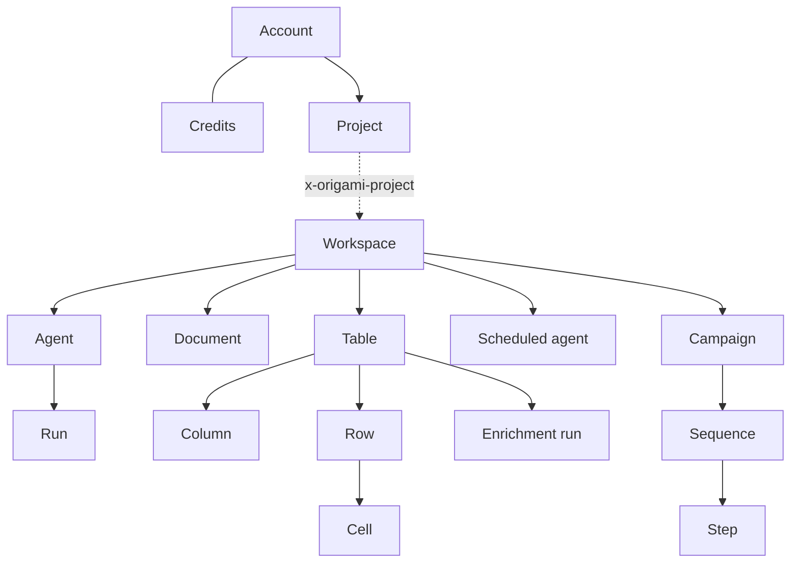

The v2 API is organized around a small set of objects: projects, agents, runs,
workspaces, tables, campaigns, and a few more. Every response is one of these
objects (or a list of them), and each object links to the others by id. Learn
the objects once and the endpoints follow — a `GET`, a `POST`, and a delete for
each, all shaped the same way.

If you've used the Stripe API, this will feel familiar: resource-oriented URLs,
self-describing JSON, and one list envelope everywhere.

## How every object is shaped

Three conventions hold across the entire API. Internalize these and you can read
any response without checking the reference.

**Objects name their own type.** Every object carries an `object` field naming
what it is — `"agent"`, `"run"`, `"table"`, `"campaign"`, and so on. You never
have to infer a type from context.

```json
{ "object": "agent", "id": "a1b2…", "name": "Austin founders", "workspaceId": "ws_…" }
```

**Lists share one envelope.** Every list endpoint returns the same shape, with
the page under `items` and an opaque `nextCursor`. Some lists add a top-level
`total`.

```json
{
  "object": "list",
  "items": [ { "object": "table", "id": "…" } ],
  "nextCursor": "eyJ…",
  "url": "/api/v2/tables"
}
```

Pass `nextCursor` back as the `cursor` query parameter to get the next page;
`nextCursor: null` marks the last one. There is no `page`/`pageSize`. See
[reading data](/reading-data) for the full pagination walkthrough.

**Objects reference each other by id.** A run carries an `agentId` and a
`workspaceId`; a table carries a `workspaceId`; a sequence carries a
`campaignId`, `tableId`, and `rowId`. Follow the ids to move between objects.

## The object graph



Read it top-down: your **account** contains **projects**; a project (or the
parent org itself) contains **workspaces**; a workspace holds **tables**,
**documents**, **agents**, and **campaigns**; and the rest hang off those.

## Tenancy: parent org and projects

Every API key is **parent-wide** — it belongs to your parent (agency)
organization and can act on the parent or any of its projects.

<ResponseField name="Project" type="object">
  A **child org** under your parent — a customer's isolated set of workspaces
  and tables. Credits and the concurrency pool stay shared at the parent; a
  project can carry an optional `monthlyCredits` budget cap. Manage projects
  from the parent with [`GET /projects`](/agents/reference/list-projects),
  [`POST /projects`](/agents/reference/create-project), and
  [`GET`](/agents/reference/get-project) /
  [`PATCH`](/agents/reference/update-project) /
  [`DELETE /projects/{projectId}`](/agents/reference/delete-project).
</ResponseField>

<ResponseField name="Account" type="object">
  Your org's plan, capabilities, and workspace usage, from
  [`GET /account`](/agents/reference/get-account). Always parent-scoped.
</ResponseField>

<ResponseField name="Credits" type="object">
  Your credit balance, from [`GET /account/credits`](/agents/reference/get-credits).
  Credits are the billing unit for agent runs and enrichment.
</ResponseField>

To act inside a project, send the `x-origami-project: <projectId>` header on any
request. Omit it to act on the parent. The `/projects/*` and `/account`
endpoints ignore the header. See [authentication](/authentication#projects-and-the-x-origami-project-header)
for details.

## Agents and runs

<ResponseField name="Agent" type="object">
  An AI worker in a workspace. You create one, then drive it with runs. An agent
  does one run at a time. Endpoints: [`POST /agents`](/agents/reference/create-agent),
  [`GET /agents`](/agents/reference/list-agents),
  [`GET /agents/{id}`](/agents/reference/get-agent),
  [`DELETE /agents/{id}`](/agents/reference/archive-agent).
</ResponseField>

<ResponseField name="Run" type="object">
  One prompt and the work that follows it. Runs are asynchronous — you get a
  `running` run back immediately and poll until `status` is terminal. Endpoints:
  [`POST /agents/{id}/runs`](/agents/reference/send-run),
  [`GET /agents/{id}/runs`](/agents/reference/list-runs),
  [`GET /agents/{id}/runs/{runId}`](/agents/reference/get-run),
  [`POST /agents/{id}/cancel`](/agents/reference/cancel-run). See the
  [run object](/agents/run-object) for every field.
</ResponseField>

<ResponseField name="Scheduled agent" type="object">
  A recurring agent that runs on a cron schedule. Full CRUD plus
  enable/disable, manual trigger, and run history under
  [`/scheduled-agents`](/agents/reference/list-scheduled-agents).
</ResponseField>

## Data: workspaces, tables, rows

<ResponseField name="Workspace" type="object">
  A container for tables, documents, agents, and campaigns. Agents auto-create
  one when you don't supply a `workspaceId`. Endpoints:
  [`GET /workspaces`](/agents/reference/list-workspaces),
  [`POST /workspaces`](/agents/reference/create-workspace),
  [`GET /workspaces/{workspaceId}`](/agents/reference/get-workspace),
  [`DELETE /workspaces/{workspaceId}`](/agents/reference/delete-workspace).
</ResponseField>

<ResponseField name="Table" type="object">
  A set of rows and the columns that enrich them, plus lifetime credit cost.
  Read one with [`GET /tables/{tableId}`](/agents/reference/get-table); list
  them with [`GET /tables`](/agents/reference/list-tables).
</ResponseField>

<ResponseField name="Column" type="object">
  A field on a table, classified by `kind`: `input` (user-entered, the only
  writable kind), `enrichment` (runs per row to fetch a value), `score`
  (relevance), or `sequence` (drafts outreach). List with
  [`GET /tables/{tableId}/columns`](/agents/reference/list-columns).
</ResponseField>

<ResponseField name="Row" type="object">
  One record in a table (the wire vocabulary calls these "leads" —
  `leadCount`). Cells are keyed by column slug and typed. Read with
  [`GET /tables/{tableId}/rows`](/agents/reference/list-rows) or
  [`GET /tables/{tableId}/rows/{rowId}`](/agents/reference/get-row). Write with
  [`POST /tables/{tableId}/rows/upsert`](/agents/reference/upsert-rows) or the
  CSV variant [`.../rows/upsert-file`](/agents/reference/upsert-rows-file).
</ResponseField>

<ResponseField name="Cell" type="object">
  A single column's value on a single row, with run metadata where present.
  Read with
  [`GET /tables/{tableId}/rows/{rowId}/cells/{columnId}`](/agents/reference/get-cell).
</ResponseField>

<ResponseField name="Enrichment run" type="object">
  A tracked batch of column-over-row work — every upsert and file ingest creates
  one. Poll it for status, counts, credits used, and per-row upsert outcomes.
  Endpoints: [`GET /enrichment-runs`](/agents/reference/list-enrichment-runs),
  [`GET /enrichment-runs/{runId}`](/agents/reference/get-enrichment-run),
  [`GET /tables/{tableId}/enrichment-runs`](/agents/reference/list-table-enrichment-runs).

  <Note>
    An enrichment run is the object formerly called a "batch". `GET /batches`
    and `GET /batches/{batchId}` remain as deprecated aliases; its `id` and
    `batchId` fields hold the same value.
  </Note>
</ResponseField>

<ResponseField name="Document" type="object">
  A file uploaded into a workspace. Upload, list, read, rename, and delete under
  [`/workspaces/{workspaceId}/documents`](/agents/reference/list-documents).
</ResponseField>

## Outreach: campaigns, sequences, steps

<ResponseField name="Campaign" type="object">
  A first-class outreach campaign, homed in a workspace. Its queue is the set of
  sequences stamped with its id — one per person. Create and edit campaigns
  agentically ([`POST /tables/{tableId}/campaigns`](/agents/reference/create-campaign),
  [`POST /campaigns/{campaignId}/edits`](/agents/reference/edit-campaign)); read
  people and stats; and control its lifecycle with
  [launch](/agents/reference/launch-campaign),
  [pause](/agents/reference/pause-campaign), and
  [resume](/agents/reference/resume-campaign).
</ResponseField>

<ResponseField name="Sequence" type="object">
  One recipient's thread within a campaign — in the campaign model, a person
  *is* a sequence. Read one with its steps inline
  ([`GET /sequences/{sequenceId}`](/agents/reference/get-sequence)), list them
  in scope, [stop](/agents/reference/stop-sequence), or
  [delete](/agents/reference/delete-sequence). Content edits go through the
  campaign edit, not the sequence.
</ResponseField>

<ResponseField name="Step" type="object">
  A single message or connection request within a sequence — channel, subject,
  body, and send status. Returned inline on the sequence detail.
</ResponseField>

## Working conventions

<CardGroup cols={2}>
  <Card title="Async runs" icon="clock" href="/agents/run-object">
    Agent work returns a `running` run; poll until `status` is terminal, honoring
    `Retry-After`.
  </Card>
  <Card title="Cursor pagination" icon="list" href="/reading-data">
    Every list returns `{ items, nextCursor }`. Pass `nextCursor` back as
    `cursor`.
  </Card>
  <Card title="Authentication" icon="key" href="/authentication">
    Parent-wide API keys and the `x-origami-project` header for project scoping.
  </Card>
  <Card title="Migrating from v1" icon="arrow-right" href="/api-v1-to-v2-migration">
    Map every v1 route to its v2 equivalent.
  </Card>
</CardGroup>

**Idempotency.** Any `POST` can send an `Idempotency-Key` header; the first
response is replayed for retries with the same key for 24 hours. Row upserts also
dedup on the body `batchId`.

**Errors.** Every error uses `{ error, code, details?, handoff? }`. Codes are
`UPPERCASE_SNAKE_CASE`. A 4xx the user can fix in-app carries a forwardable
`handoff` link.

## Where to start

<Steps>
  <Step title="Authenticate">
    Create an API key and confirm access with
    [`GET /account`](/agents/reference/get-account). See
    [authentication](/authentication).
  </Step>
  <Step title="Run an agent, or bring your own data">
    Hand a brief to [`POST /agents`](/agents/reference/create-agent) and let it
    build a table — follow the [quickstart](/agents/quickstart). Already have
    rows? Upsert them with
    [`POST /tables/{tableId}/rows/upsert`](/agents/reference/upsert-rows).
  </Step>
  <Step title="Read the results">
    Pull rows with
    [`GET /tables/{tableId}/rows`](/agents/reference/list-rows) — see
    [reading data](/reading-data).
  </Step>
  <Step title="Reach out (optional)">
    Draft a campaign with
    [`POST /tables/{tableId}/campaigns`](/agents/reference/create-campaign), then
    [launch](/agents/reference/launch-campaign) it.
  </Step>
</Steps>
