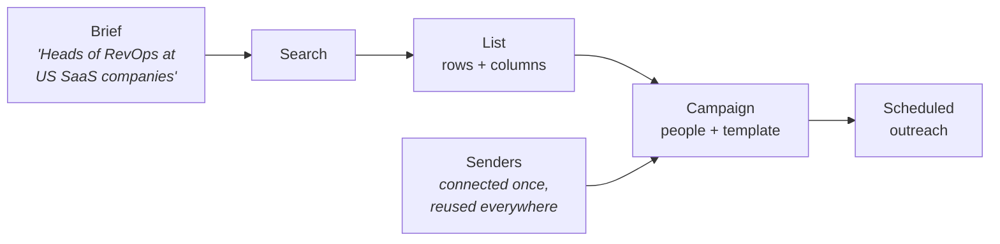

Origami finds people who look like your customers, researches them, and emails
them. The v3 API is that product with the buttons taken off:

- **Leads** builds a grid of prospects: rows are people, columns are facts about
  them. You describe who you want in a sentence; Origami fills in the rows and
  researches each one.
- **Send** turns those prospects into an email or LinkedIn sequence and runs it
  on a schedule from mailboxes you own.
- **Account** holds everything the other two need: sending mailboxes, domains,
  credits, do-not-contact lists, API keys, and webhooks.

Anything that takes longer than a request — sourcing leads, researching a
column, generating copy — hands you back a **Job** and finishes in the
background.

## How the pieces connect



Read it left to right and you have the whole API. A **brief** produces a
**search**, a search fills a **list**, a list feeds a **campaign**, and a
campaign sends from **senders** you connected once.

Each of those arrows is a Job — you fire the call, then either poll or take a
webhook when it lands. Same object every time, so you write that logic once.

<Card title="What each object is and where it comes from" icon="box" href="/v3/objects" horizontal>
  Every noun in the API, on one page.
</Card>

## Start here

<CardGroup cols={2}>
  <Card title="Quickstart" icon="rocket" href="/v3/quickstart">
    Find 25 leads and read them back. Three requests, about five minutes.
  </Card>
  <Card title="Build a list" icon="table" href="/v3/leads">
    The three ways rows get into a list, and how enrichment fills them in.
  </Card>
  <Card title="Run a campaign" icon="send" href="/v3/send">
    The send recipe in order: people, template, senders, launch.
  </Card>
  <Card title="Set up the account" icon="settings" href="/v3/account">
    Mailboxes, domains, credits, exclusions, webhooks, and keys.
  </Card>
</CardGroup>

## Making requests

Every v3 request goes to one base URL and carries an API key:

```bash
curl https://origami.chat/api/v3/account \
  -H "Authorization: Bearer $ORIGAMI_API_KEY"
```

Create a key in **Settings → Developers**. Keys belong to your parent
organization; add `x-origami-project: <project_id>` to act inside a child
project instead. See [authentication](/authentication) for roles, project
scoping, and rate limits.

Beyond that there are five wire rules — snake_case fields, one pagination
envelope, `202` plus a Job for async work, `Idempotency-Key` on retries, and a
single error shape. They are on one page:

<Card title="Conventions" icon="list-checks" href="/v3/conventions" horizontal>
  Paging, errors, idempotency, destructive-call previews, and project scoping.
</Card>

## Three ways to call it

The same operation catalog is exposed three ways, with the same names and the
same behavior:

| Transport | Use it when |
| --- | --- |
| **HTTP** — `https://origami.chat/api/v3` | You're writing code. Everything on this tab documents it. |
| **MCP** — `https://origami.chat/mcp` | You want an AI assistant to drive Origami directly. |
| **CLI** — `origami` | You're working in a terminal or a shell script. |

Operation ids like `leads.searches.create` are the same in all three, so the
reference pages here apply whichever one you use.

The MCP server is streamable HTTP at `/mcp`, with the same `og_live_…` bearer
as `/api/v3`. Point Cursor (or any MCP client) at:

```json
{
  "mcpServers": {
    "origami": {
      "url": "https://origami.chat/mcp",
      "headers": {
        "Authorization": "Bearer og_live_…"
      }
    }
  }
}
```

Use `https://origami.chat/mcp`. `https://mcp.origami.chat` is not a host.

<Tip>
  Building with an AI coding assistant?
  [Install the Origami skill](/v3/skill) so it knows these operations, or
  [download the OpenAPI spec](https://raw.githubusercontent.com/Origami-Agents/mintlify-docs/main/openapi-v3.yaml)
  for client generators and Postman.
</Tip>

<Note>
  v1 and v2 still work with the same keys and have no removal date, but new
  integrations should target v3. The
  [v2 → v3 migration guide](/api-v2-to-v3-migration) maps every old flow to its
  replacement.
</Note>
